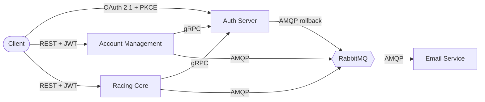

# Mobility Systems

A production-grade microservices platform exploring modern distributed-systems
patterns: **OAuth 2.1 + OIDC**, **gRPC** for internal calls, **RabbitMQ** for
async workflows, and the **saga pattern** for distributed transactions.

## The platform

Six repositories, each owning a clear responsibility:

- **[mobility-authserver](https://github.com/mobility-systems/auth-server)** — OAuth 2.1 + OIDC authorization server
- **[account-management](https://github.com/mobility-systems/account-management)** — user & organization registration
- **[racing-core](https://github.com/mobility-systems/racing-core)** — domain service for cars, drivers, laps, tracks
- **[email-service](https://github.com/mobility-systems/email-service)** — Go-based RabbitMQ consumer for transactional email
- **[mobility-common](https://github.com/mobility-systems/mobility-common)** — shared Maven library (protos, queues, saga primitives)
- **[mobility-app](https://github.com/mobility-systems/mobility-app)** — umbrella repo with architecture docs, ADRs, and `docker-compose.yml` that runs everything

## 👉 Start here: [mobility-app](https://github.com/mobility-systems/mobility-app)

The umbrella repo contains the architecture deep dive, saga flow diagrams,
architectural decision records, and instructions to run the full platform locally.

---

*Source-available portfolio project. See each repo's NOTICE for usage terms.*# .github