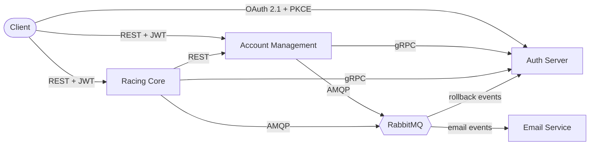

# Mobility Systems

A production-grade microservices platform exploring modern distributed systems
patterns: **OAuth 2.1 + OIDC**, **gRPC** for internal calls, **RabbitMQ** for
async workflows, and the **saga pattern** for distributed transactions with
compensating rollbacks across the microservices.

**Built with Java 21 · Spring Boot 3.5.6 · Spring Authorization Server · PostgreSQL · Redis · RabbitMQ**

## The platform

6 repositories, each owning a clear responsibility:

- **[auth-server](https://github.com/mobility-systems/auth-server)** -> OAuth 2.1 + OIDC custom authorization server built on Spring Authorization Server
- **[account-management](https://github.com/mobility-systems/account-management)** -> User and organization registration
- **[racing-core](https://github.com/mobility-systems/racing-core)** -> domain service for cars, drivers, laps, tracks
- **[email-service](https://github.com/mobility-systems/email-service)** -> RabbitMQ consumer for transactional emails
- **[mobility-common](https://github.com/mobility-systems/mobility-common)** -> Shared Maven library which contains gRPC protos, RabbitMQ queue definitions, shared code between microservices(saga classes, exceptions, utils etc)
- **[mobility-architecture](https://github.com/mobility-systems/mobility-architecture)** -> Umbrella repository with architecture docs, ADRs, and `docker-compose.yml`

## 🏎️▶️ Start here: [mobility-architecture](https://github.com/mobility-systems/mobility-architecture)

The umbrella repo contains the architecture deep dive, saga flow diagrams,
architectural decision records, and instructions to run the full platform locally.

---

*Source-available portfolio project. See each repo's NOTICE for usage terms.*